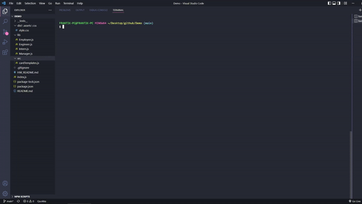
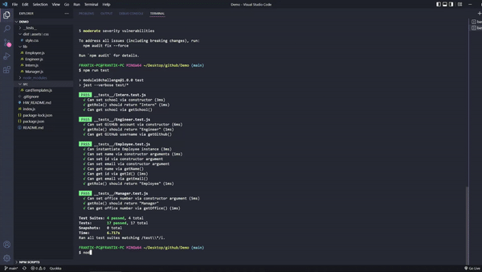
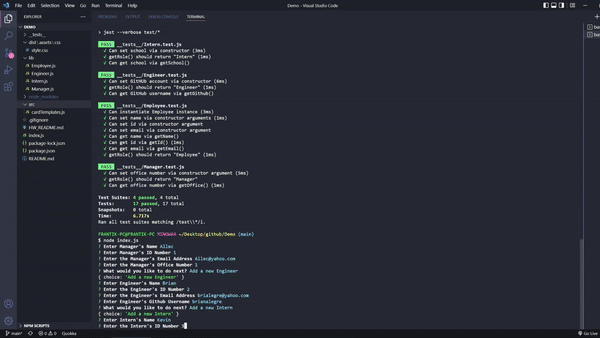
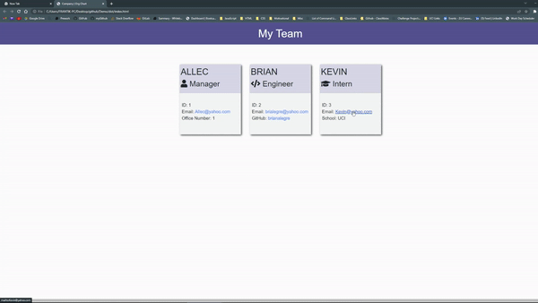

# 10-OOP-Homework

## Table of Contents
- [Description](#description)
- [Application Preview](#application-preview)
- [Installation](#installation)
- [Usage](#usage)
- [Links](#links)
- [Criteria](#criteria)
- [Questions](#questions)
- [License](#license)

## Description
Build a Node.js command-line application that takes in information about employees on a software engineering team, then generates an HTML webpage that displays summaries for each person.

## Application Preview

    

    

    

    

## Installation
- Copy the repository to your system, 
- npm install
- node index.js

## Usage
- Quickly and easily create a Team Org Web Page

## Links
-   Github Repository:
    - https://github.com/brianalegre/10-OOP-Homework
-   Video Demo (Youtube):
    - https://youtu.be/1Uyonx65ANI
-   Video Demo (Github):
    - https://github.com/brianalegre/10-OOP-Homework/blob/main/dist/assets/images/TeamProfileGenDemo.mp4

## Criteria
- Jest (Tests)
    - https://www.npmjs.com/package/jest
- Inquirer (Prompts)
    - https://www.npmjs.com/package/inquirer
- HTML generated from CLI inputs
    - Card for each Employee
    - Email link works correctly
    - Github Username links works
- Start of Application
    - Prompt to enter Manager's Info
        - Name
        - Employee ID
        - Email address
        - Office Number
    - Prompt to add Engineer, Intern, or Finish
    - Prompt for Engineer's Info 
        - Name
        - Employee ID
        - Email address
        - Github Username
        - Taken back to the menu for Engineer, Intern, or Finish
    - Prompt for Intern
        - Name
        - Employee ID
        - Email address
        - School
        - Taken back to the menu for Engineer, Intern, or Finish
    - When Finish is selected
        - HTML is generated with all the info provided from Prompts
- CSS Styling is up to you
- Classes
    - Employee
        - Parent Class
        - name
        - id
        - email
        - getName()
        - getEmail()
        - getRole()
            - Returns Employee
    - Manager
        - Extend Employee Class
        - officeNumber
        - getRole()
            - overriden, returns Manager
    - Engineer
        - Extend Employee Class
        - github
        - getGithub()
        - getRole()
            - overriden, returns Engineer
    - Intern
        - Extend Employee Class
        - school
        - getSchool()
        - getRole()
            - overriden, returns Intern

## Questions
Questions? Concerns?  Contact Me Below:
- Github Username: brianalegre
- Github Link: https://github.com/brianalegre 
- Email: brialegre@yahoo.com

## License
- Copyright 2022 Brian Alegre
- Licensed under the: [MIT License](https://opensource.org/licenses/MIT) 

